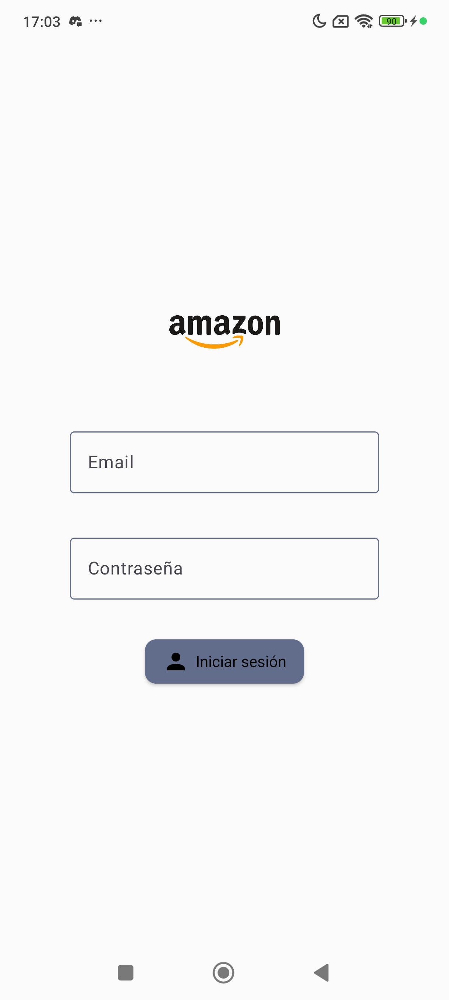
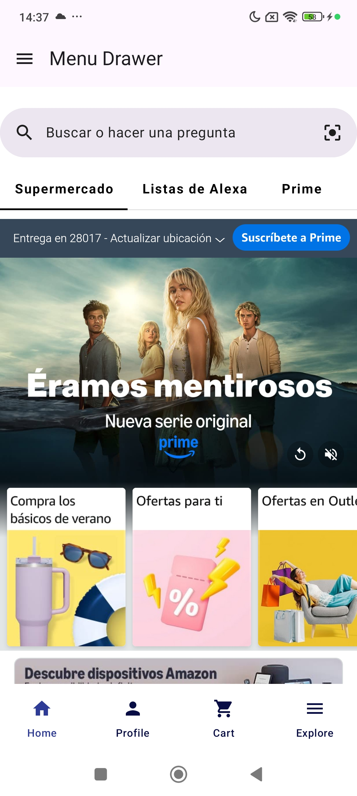
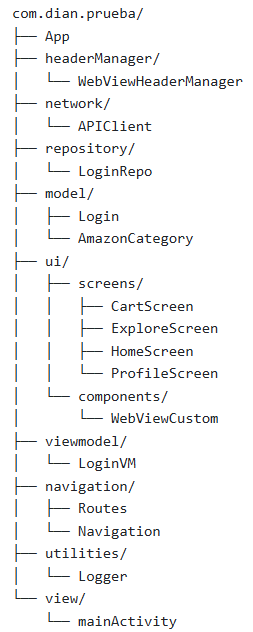

<h1 align="center">Proyecto Mock Multiplatform para iOS y Android</h1>

Este proyecto es una aplicación mock desarrollada con **Compose Multiplatform**. Fue creada con el objetivo de simular el comportamiento de una app real, incorporando pruebas automatizadas, flujos de trabajo, firma de la aplicación, principios de arquitectura, entre otros aspectos clave. No se ha tenido muy en cuenta el diseño de la interfaz de usuario y se ha basado en la aplicación móvil de **Amazon**.

## Reflexiones
Este proyecto lo desarrollé durante mis **3 meses** de prácticas en una empresa a la que le tengo mucho cariño. Me permitió descubrir muchos conceptos y herramientas que desconocía y que considero esenciales en el desarrollo de software, pero que no suelen enseñarse ni en institutos ni en cursos básicos.

Gran parte del tiempo lo dediqué a **investigar, resolver errores y comprender herramientas nuevas**. Por ejemplo, tuve dificultades al escribir tests unitarios, porque no había planteado bien la escalabilidad desde el inicio. También aprendí que los tests que había hecho con Appium no eran robustos: al cambiar pequeños detalles de la interfaz en el emulador de los flujos de trabajo, los elementos definidos por xPath dejaban de funcionar.

Este tipo de problemas solo los ves cuando te enfrentas a ellos de verdad. Si eres junior o estás empezando, te animo a crear tu propio proyecto desde cero, pensando como si lo fueras a publicar: incluyendo testing, arquitectura limpia y flujos de trabajo. Aprenderás muchísimo, te lo aseguro :D

📝 *PD: Verás unos 300 (o cientos más) commits relacionados con workflows. ¡Fue parte del aprendizaje! (Se han solucionado con un **squash**)*

## Screenshots
 

## Tech Stack
- [JSONPlaceholder](https://jsonplaceholder.typicode.com/) - API de prueba
- [WebView](https://github.com/KevinnZou/compose-webview-multiplatform/tree/main) - Navegación Web para Multiplatform
- [JUnit4](https://mvnrepository.com/artifact/org.jetbrains.compose.ui/ui-test-junit4) - JUnit testing
- [Settings](https://github.com/russhwolf/multiplatform-settings) - Persistencia de datos Multiplatform
- [Ktor](https://ktor.io/docs/client-serialization.html#register_cbor) - Networking library
- [Navigation](https://mvnrepository.com/artifact/org.jetbrains.androidx.navigation/navigation-compose) - Multiplatform navigation 
- [Appium para testing](https://appium.io/docs/en/2.2/quickstart/) - E2E testing 
- [KMPNotifier](https://github.com/mirzemehdi/KMPNotifier?tab=readme-ov-file) - Multiplatform Push Notifications Library
- [FCM](https://firebase.google.com/docs/cloud-messaging?hl=es-419) - Firebase Cloud Messaging for Notifications
- [SplashScreen](https://developer.android.com/jetpack/androidx/releases/core?hl=es-419#core_splashscreen_version_12_2) - Launch Screen

## Conceptos que se han visto
- [Git](https://learngitbranching.js.org/?locale=es_ES)
- [TDD](https://www.browserstack.com/guide/what-is-test-driven-development)
- [Conventional commits](https://www.conventionalcommits.org/en/v1.0.0/)
- [Key events de Android](https://elementalx.org/button-mapper/android-key-codes/)
- [Kinds of static analyses](https://github.com/readme/guides/formatters-linters-compilers)
- [Principios de Clean Architecture](https://medium.com/@diego.coder/introducci%C3%B3n-a-las-clean-architectures-723fe9fe17fa)
- [SOLID](https://secture.com/solid-dependency-inversion-principle/)
- [CI/CD](https://www.reddit.com/r/devops/comments/t5nufe/eli5_what_is_cicd_and_why_do_we_need_them/)
- [Tokens](https://dev.to/jeanvittory/jwt-refresh-tokens-2g3d)
- [Github Actions](https://docs.github.com/en/actions/writing-workflows/quickstart)
- [Estructura MVVM](https://medium.com/@ashfaque-khokhar/android-mvvm-and-repositories-folder-structure-7de1a2dbb825)

## Features

- **Multiplatform** (android and iOS)

- **Simulador de Login con validación básica:** El usuario solo puede poner un email que contenga ‘@’ y un ‘.’ Mientras que la contraseña tiene que tener entre 6 y 20 caracteres. Cuando el usuario ingresa a la aplicación por primera vez ingresa un email y una contraseña, si no es válida le saldrá una alerta explicándole la validación, si el usuario no ingresa ningún dato le saldrá una alerta de que no se permiten campos vacíos. Finalmente, si el usuario ingresa credenciales válidas podrá ingresar a la aplicación (No se hacen nada con estas credenciales). Son 3 tipos de login: Valid, Invalid y Empty.
  
- **Simulador de Tokens (con persistencia):** El accessToken es el email que obtenemos de la API de JSONPlaceHolder y el refreshToken es un número random de 10 dígitos, solo se generan si el Login ha sido exitoso, por eso cada vez que se entra a la aplicación se verifica eso. Además estos tokens se inyectan en cada pantalla.
  
- **Simulador de actualización de aplicación (persistente):** Si la versión del usuario es distinta de la nueva versión, se entenderá que el usuario tiene que actualizar la aplicación para poder usarla normalmente. Por eso, le saldrá una alerta de actualización, a la que tendrá que seguir si quiere navegar por la aplicación. Si decide actualizar se le redirigirá a la Play Store (en Android), luego podrá volver a la aplicación y navegar con normalidad, no le saldrá más la actualización. Cada vez que el usuario ingresa a la app se verifican los datos de actualización para saber si mostrar la alerta o no.
  
- **Simulador de Logout:** El usuario podrá “cerrar sesión” desde la pantalla de Profile y eso significará que se limpiarán los tokens que estaban y se redirigirá al usuario a la pantalla del Login, no pudiendo hacer back.
  
- **Uso de WebView en BottomNavigation y en MenuDrawer:** Se usan como webViews páginas de la web de Amazon, la aplicación consta de 4 pantallas principales: Home, Profile, Cart y Explore. Además hay un MenuDrawer (contiene un webView) que solo se activa pulsando el icono hamburguesa, para cerrarlo el usuario hace swipe hacia la izquierda.

- **Status bar y Navigation bar transparente con sus iconos visibles dependiendo del tema:** Si el tema es claro por default los iconos son blancos, pero al tener el fondo de color claro no se verían, por eso ahora son de color oscuro para que el usuario pueda visualizar mejor esos elementos (de momento no hay un Theme de la app establecido por nosotros).

- **Buscador en la pantalla principal Home:** De forma predefinida se verá la página principal de Amazon, pero el usuario podrá usar el el buscador (el de compose, no el del webview) y el webview se recargará con la petición del usuario.

## Arquitectura
Se implementa el patrón **MVVM (Model - View - ViewModel)**.

## Directory tree

> Árbol generado con: https://tree.nathanfriend.com/
